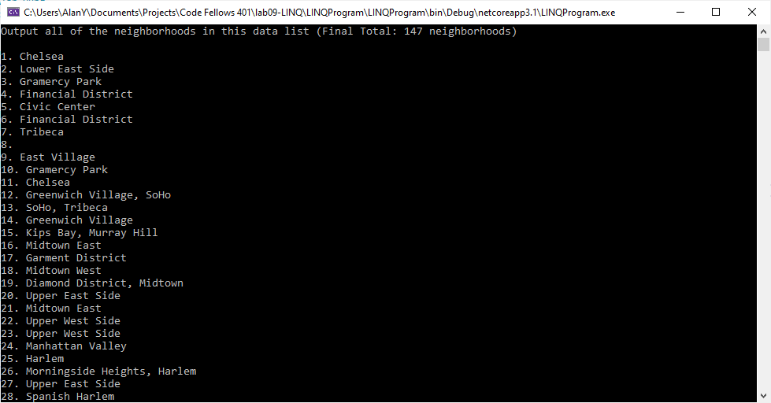
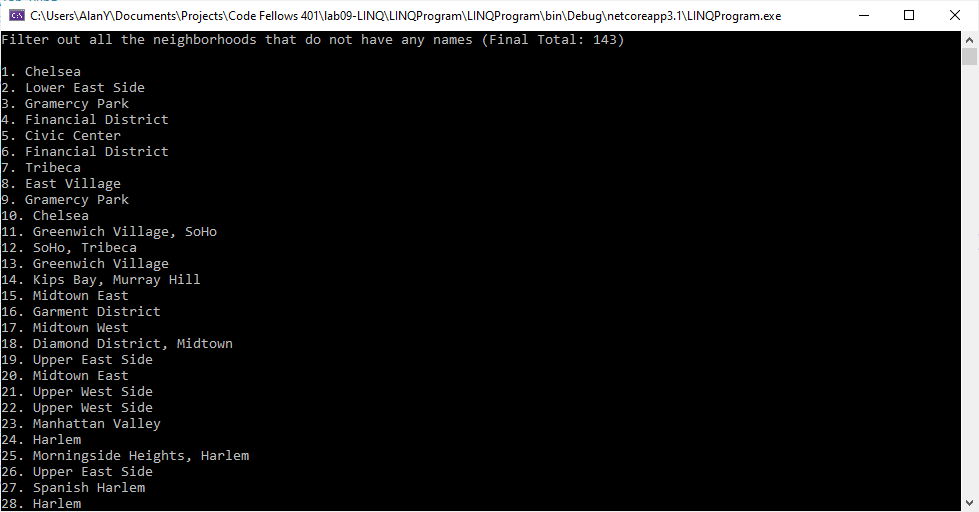
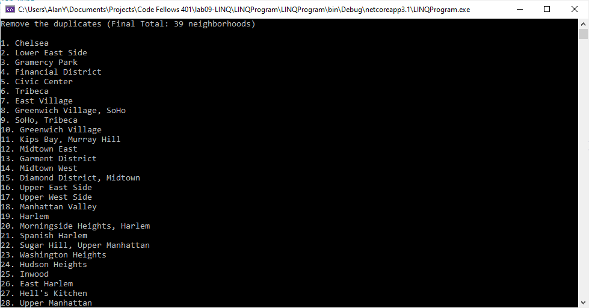
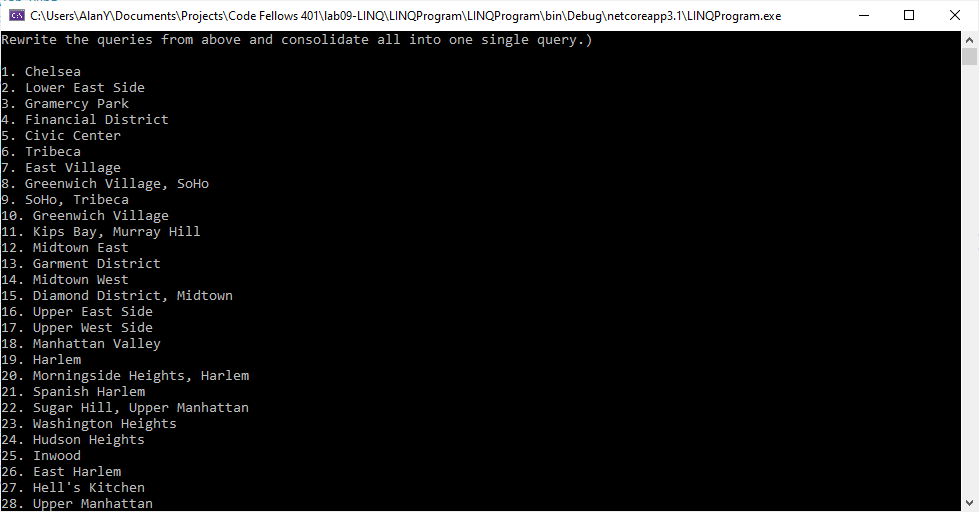
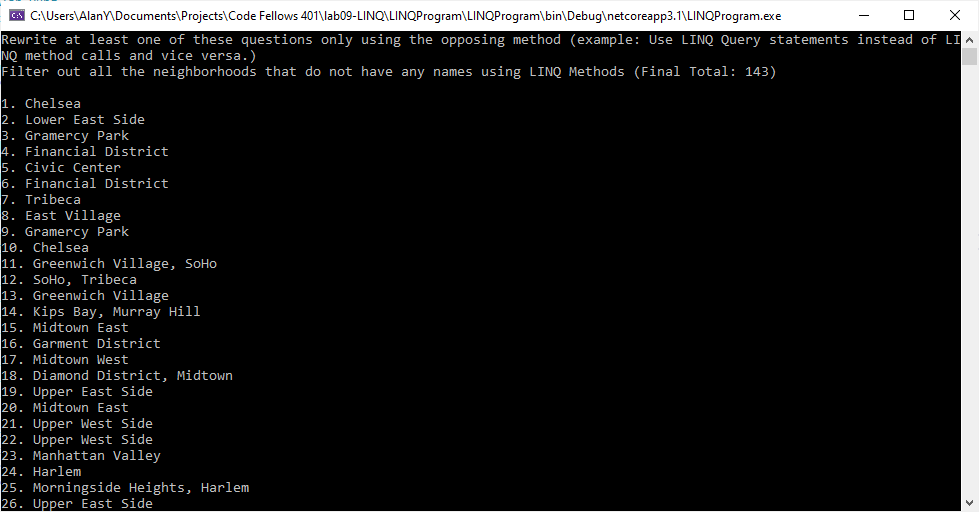

# Lab09-LINQ

## Author: Alan Hung
## Contributors: David Dicken, Scott Falbo

### Getting Started
* Open Visual Studio
* Clone [Lab 09 Git Repository](https://github.com/AlanYHung/Lab09-LINQProgram-DotNet)
* Click Run

### Example
* 
* 
* 
* 
* 

### Change Log
* 0.1.0 - 1/21/2021 2:30pm - Initial Repo and Project Setup
* 0.2.0 - 1/21/2021 2:45pm - File Read from data.json
* 0.4.0 - 1/21/2021 4:00pm - Setup Classes to store json data
* 0.7.0 - 1/21/2021 5:30pm - Successfully Parsed Json Data into List Object
* 0.8.0 - 1/21/2021 6:00pm - Queries 1 and 2 written and tested
* 0.9.0 - 1/21/2021 6:45pm - Queries 3 written and tested
* 1.0.0 - 1/21/2021 7:00pm - Queries 4 and 5 written and tested

### Attribution
* [Microsoft Docs](https://docs.microsoft.com/en-us/dotnet/csharp/language-reference/)
* [JSON to C# Class Constructor](https://json2csharp.com/)
